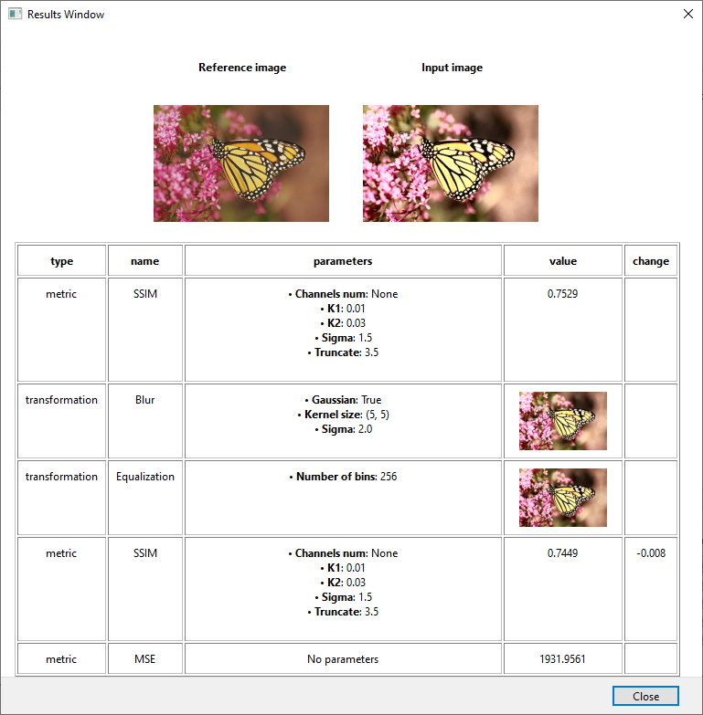

<p align="center">
    
    <p align="center"><strong>C</strong>omputer <strong>I</strong>mage <strong>Li</strong>keness A<strong>ss</strong>essing <strong>A</strong>utomation</p>
</p>

## Requirements

* Python >= 3.7

### GUI (Linux)

* libopengl0

## Installation

### Build from source

```bash
# Using poetry
$ poetry install

# Install optional dependencies for GUI
$ poetry install -E gui
```

## Usage

### GUI

<p align="center">
    
    
</p>

More information about the GUI can be found in the [cilissa_gui/README.md](cilissa_gui/README.md) file

### CLI

Currently the CLI only supports working with a single pair of images.

The parameters of metrics and transformations can be modified by passing them to the `--kwargs` argument using the following format:
```
<operation-name>-<parameter-name>=<value>
``` 
where `parameter-name` uses hyphens (-) instead of underscores (_)

### Library

* Example: image pair analysis

```python
from cilissa.images import Image, ImagePair
from cilissa.metrics import SSIM, MSE
from cilissa.operations import OperationsList

image1 = Image("path/to/original/image")
image2 = Image("path/to/other/image")
image_pair = ImagePair(image1, image2)

# Compare using standalone metric
ssim = SSIM(channels_num=3)
result = ssim.analyze(image_pair)

# Or use OperationsList
mse = MSE()
operations = OperationsList([mse, ssim])
results = operations.run_all(image_pair)
```

* Example: image transformation

```python
from cilissa.images import Image
from cilissa.transformations import Blur

image = Image("path/to/original/image")

# Transform using standalone transformation
blur = Blur(gaussian=False, sigma=2.0)
result = blur.transform(image)
```
